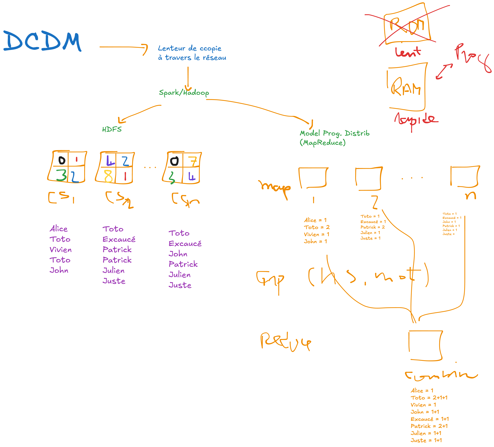

.. _part1_chap1:

***********************************************************************
Chapitre 1 : Introduction au big data
***********************************************************************

Le **big data** désigne des données **massives** (de très grande taille). Mais la
taille seule ne suffit pas à les définir.

Objectifs
=========

À la fin de ce chapitre, vous devez pouvoir :

- Définir le big data par les **5V**
- Rappeler ce qu'est le data mining (et le *pattern mining*)
- Expliquer pourquoi le calcul doit être **distribué**

1. Taille et ordres de grandeur
===============================

La taille d'un jeu de données = l'espace mémoire occupé (octets). Multiples du Go :

- **Téra** (To) ≈ 10¹² o · **Péta** (Po) ≈ 10¹⁵ o · **Exa** (Eo) · **Zetta** (Zo) · **Yotta** (Yo).

On produit aujourd'hui plus de **200 Zo par an**. On considère souvent le seuil du
big data autour de **> 1 Po** — mais **la taille ne suffit pas** : il faut les 5V.

2. Les 5V du big data
=====================

.. list-table::
   :header-rows: 1
   :widths: 20 80

   * - V
     - Définition
   * - **Volume**
     - La taille des données
   * - **Vitesse** (*velocity*)
     - La rapidité de collecte / de production / de traitement
   * - **Variété**
     - Données structurées **et** non structurées (images, vidéos, texte, audio)
   * - **Véracité**
     - Fiabilité, précision, qualité des données
   * - **Valeur**
     - Utilité des données : à quoi servent-elles, quelles décisions permettent-elles ?

3. Big data et data mining
==========================

Le **data mining** (fouille de données) vise à **découvrir des informations
cachées** dans les données pour prendre des **décisions**. L'information prend
souvent la forme de **motifs** (*pattern mining*) ou de **groupes** (clustering).

.. note::
   Les fondamentaux du data mining (définition, *pattern mining*, terminologies)
   sont introduits dans le cours de Data Mining :
   `DM — chapitre 1 (Introduction au data mining)
   <https://johnaoga.github.io/gl-dm/part1/chap1.html>`_ (**→ DM**).

Le **big data + data mining** = découvrir des informations (cachées) dans des
données **massives**.

4. Pourquoi distribuer le calcul ?
==================================

Les algorithmes de traitement **classiques** (une seule machine, données en
mémoire) ne passent pas à l'échelle face aux données massives. La solution : les
**distribuer** sur plusieurs machines (un *cluster*). Deux défis :

- **comment distribuer** le calcul/traitement sur plusieurs nœuds ?
- **comment écrire** un programme distribué (correct, tolérant aux pannes) ?

   Le calcul distribué pour la fouille de données massives.

C'est précisément le rôle de **MapReduce** (:doc:`chapitre 2 <chap2>`).

Exercices
=========

.. admonition:: Exercice 1
   :class: tip

   Une plateforme collecte 5 To de logs **par jour**. Combien de Po par an
   (approximativement) ? Est-ce du « big data » au seul critère de taille ?

.. raw:: html

   

▶ Voir la correction

5 To/jour × 365 ≈ **1 825 To ≈ 1,8 Po/an**. Au seul critère de taille (> 1 Po),
oui ; mais il faut aussi considérer les autres V (vitesse de collecte des logs,
variété, véracité, valeur) pour parler vraiment de big data.

.. raw:: html

   

.. admonition:: Exercice 2
   :class: tip

   Pour chacune des situations, indiquez le **V** dominant : (a) des capteurs IoT
   émettent 10 000 mesures/seconde ; (b) on mélange tweets, images et relevés GPS ;
   (c) certaines mesures de capteurs sont erronées.

.. raw:: html

   

▶ Voir la correction

(a) **Vitesse** — débit très élevé ; (b) **Variété** — types hétérogènes ;
(c) **Véracité** — qualité/fiabilité des données.

.. raw:: html

   

