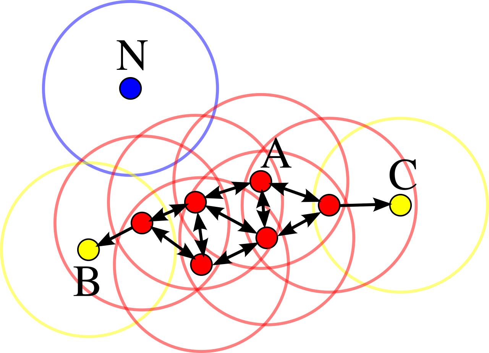

.. _part2_chap3:

***********************************************************************
Chapitre 3 : Clustering à grande échelle
***********************************************************************

Le **clustering** regroupe les observations similaires (apprentissage non
supervisé). Ici, on s'intéresse à le faire sur des données **massives**.

Objectifs
=========

À la fin de ce chapitre, vous devez pouvoir :

- Rappeler **K-means** et le **paralléliser** (MapReduce)
- Citer les catégories de clustering et des algorithmes adaptés au big data

1. Rappel : K-means
===================

.. note::
   K-means est détaillé dans le cours de Data Mining :
   `DM — Clustering (K-means, méthode du coude)
   <https://johnaoga.github.io/gl-dm/part2/chap5.html>`_ (**→ DM**).

En bref : choisir *K* ; initialiser *K* centroïdes ; **assigner** chaque point au
centroïde le plus proche ; **recalculer** chaque centroïde = moyenne de son
cluster ; répéter jusqu'à convergence.

   Les grandes catégories de clustering (distance, densité, hiérarchie).

2. Paralléliser K-means avec MapReduce
======================================

K-means est **itératif** : on lance **un job MapReduce par itération**, en
diffusant les *K* centroïdes courants à tous les mappers.

- **Map** : pour chaque point, calculer le centroïde le plus proche et émettre
  ``(id_centroïde, (point, 1))``.
- **Combiner** : sommer localement les points (et les comptes) par centroïde →
  ``(id_centroïde, (somme_partielle, compte_partiel))``.
- **Reduce** : pour chaque centroïde, sommer puis **diviser** → le **nouveau
  centroïde** (moyenne). On réinjecte les nouveaux centroïdes à l'itération
  suivante, jusqu'à stabilisation.

.. tip::
   Le combiner est crucial : il évite de transférer **tous** les points sur le
   réseau à chaque itération. (Spark, qui garde les données en mémoire entre
   itérations, est bien plus efficace que Hadoop pour ce type d'algorithme.)

3. Autres algorithmes (brève description)
=========================================

.. list-table::
   :header-rows: 1
   :widths: 22 78

   * - Algorithme
     - Idée
   * - **Clustering hiérarchique** (Hclust)
     - Fusion/division successive ; visualisé par un **dendrogramme**. Coûteux : peu adapté tel quel au big data.
   * - **DBSCAN** (densité)
     - Regroupe les zones **denses** ; détecte le bruit ; pas besoin de fixer *K*.
   * - **BFR** (*Bradley-Fayyad-Reina*)
     - Variante de K-means pour données **ne tenant pas en mémoire** : résume chaque cluster par des statistiques (N, SOMME, SOMME²) et traite les points par lots.
   * - **CURE**
     - Représente chaque cluster par **plusieurs points** (pas un seul centroïde) → gère les clusters non sphériques.

Exercices
=========

.. admonition:: Exercice 1 — K-means en MapReduce
   :class: tip

   Pourquoi faut-il **un job MapReduce par itération** de K-means ? Que diffuse-t-on
   aux mappers au début de chaque itération ?

.. raw:: html

   

▶ Voir la correction

Chaque itération dépend des centroïdes **mis à jour** par l'itération précédente ;
on ne peut donc pas tout faire en un seul passage. Au début de chaque job, on
**diffuse les K centroïdes courants** à tous les mappers pour qu'ils assignent
leurs points. On s'arrête quand les centroïdes ne bougent plus (ou < seuil).

.. raw:: html

   

.. admonition:: Exercice 2 — BFR
   :class: tip

   Dans BFR, pourquoi résume-t-on un cluster par ``(N, SOMME, SOMME²)`` plutôt que
   de garder tous ses points ?

.. raw:: html

   

▶ Voir la correction

Parce que les données ne tiennent pas en mémoire. Ces trois statistiques
suffisent à recalculer le **centroïde** (SOMME/N) et la **variance** par dimension
(SOMME²/N − (SOMME/N)²), donc à décider l'appartenance de nouveaux points — sans
conserver les points eux-mêmes. Elles sont de plus **additives** (faciles à
fusionner entre lots).

.. raw:: html

   

